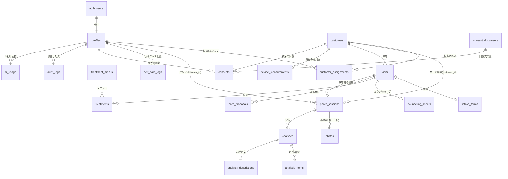

# 04. データベース設計（Supabase / PostgreSQL）

> ステータス：**第1段階（設計）— レビュー待ち**
> 本書の SQL は設計の説明用の下書きです。第2段階で `supabase/migrations/` に正式な形で作成し、テストします。

## 1. 方針

- **必要最小限のデータだけを保存する。** 顧客の生年月日は「生まれ年（任意）」まで、端末情報は「スマホ／タブレット／PC」の区別だけ、位置情報は保存しない。
- **セルフのデータとサロンのデータを分ける。** 撮影セッションは「一般ユーザー本人（`user_id`）」か「サロンの顧客（`customer_id`）」のどちらか一方だけを持つ（両方は持てない制約をつける）。
- **AI の評価と機器の実測値は別テーブル。** 列名でも区別する（`analysis_items` と `device_measurements`）。
- **写真から断定してはいけない値の列は作らない。** 肌年齢・水分量・油分量の列は AI 側のテーブルに存在しない。
- **全テーブルで RLS を有効にする。** 方針は「許可したものだけ通す」。
- 主キーは UUID。日時は `timestamptz`（保存は UTC、表示は日本時間）。

## 2. ER 図



## 3. テーブル定義

### 3.1 利用者・権限

**`profiles`**（`auth.users` と1対1。新規登録時にトリガーで自動作成）

| 列 | 型 | 説明 |
| --- | --- | --- |
| `id` | uuid PK | `auth.users.id`（ユーザー削除で一緒に削除） |
| `role` | `app_role`（`user` / `staff` / `admin`） | 既定 `user`。**本人は変更できない**（列の更新権限を与えない） |
| `display_name` | text | 表示名 |
| `is_active` | boolean | 停止中のスタッフは `false`（権限関数がすべて「権限なし」と判定） |
| `adult_confirmed_at` | timestamptz | 18歳以上であることの確認日時 |
| `created_at` / `updated_at` | timestamptz | |

**`customer_assignments`**（スタッフが担当できる顧客）

| 列 | 型 | 説明 |
| --- | --- | --- |
| `staff_id` | uuid FK → profiles | PK の一部 |
| `customer_id` | uuid FK → customers | PK の一部 |
| `granted_by` | uuid FK → profiles | 割り当てた人（管理者、または顧客を登録したスタッフ本人） |
| `granted_at` | timestamptz | |

### 3.2 サロンの顧客・来店

**`customers`**

| 列 | 型 | 説明 |
| --- | --- | --- |
| `id` | uuid PK | |
| `full_name` | text | 氏名（必須） |
| `full_name_kana` | text | ふりがな（検索用） |
| `phone` / `email` | text | 任意 |
| `birth_year` | smallint | 任意。1900〜今年の範囲チェック |
| `notes` | text | メモ（**病歴などの詳しい健康情報は書かない**よう画面で注意） |
| `created_by` | uuid FK → profiles | |
| `created_at` / `updated_at` | timestamptz | |

**`visits`**（来店）：`id`、`customer_id`、`staff_id`、`visited_at`、`status`（`in_progress` / `completed`）、`next_visit_memo`、`created_at`

**`intake_forms`**（問診。来店1件に1つ）：`visit_id` PK、`form_version`、`answers` jsonb（Zod で形を検証）、`skin_condition_under_treatment` boolean（通院中の皮膚の病気。`true` なら施術前に医師への確認を促す）、`created_at`

**`counseling_sheets`**（来店1件に1つ）：`visit_id` PK、`concerns`、`analysis_summary`、`proposal`、`customer_wishes`、`staff_notes`、`updated_at`

**`treatment_menus`**：`id`、`name`、`category`、`description`、`cautions`（禁忌・資格などの注意事項）、`price_yen` integer（0以上）、`duration_min`、`is_active`、`updated_by`、`updated_at`

**`treatments`**（施術履歴）：`id`、`visit_id`、`menu_id`、`menu_name_snapshot`、`price_yen_snapshot`（施術時点の名前と料金を残す）、`notes`、`before_session_id` / `after_session_id`（前後比較用の撮影セッション）、`created_at`

**`care_proposals`**（施術案内文）：`id`、`visit_id`、`menu_ids` uuid[]、`draft_text`（AI の下書き）、`final_text`（スタッフが確定した文）、`generated_by` (`ai` / `mock` / `manual`)、`ai_model`、`status`（`draft` / `approved`）、`approved_by`、`approved_at`

**`device_measurements`**（機器の実測値。**AI の評価とは別**）：`id`、`customer_id`、`visit_id`、`device_name`、`metric`（例：水分量）、`value` numeric、`unit`、`measured_at`、`recorded_by`

### 3.3 撮影・分析

**`photo_sessions`**（1回の撮影＝正面・左右の写真のまとまり）

| 列 | 型 | 説明 |
| --- | --- | --- |
| `id` | uuid PK | |
| `user_id` | uuid FK → profiles, null 可 | セルフの場合の本人 |
| `customer_id` | uuid FK → customers, null 可 | サロンの場合の顧客 |
| `visit_id` | uuid FK → visits, null 可 | サロンの来店時 |
| `captured_by` | uuid FK → profiles | 撮影した人 |
| `created_at` | timestamptz | |
| 制約 | | `user_id` と `customer_id` は**ちょうど一方だけ**が入る |

**`photos`**

| 列 | 型 | 説明 |
| --- | --- | --- |
| `id` | uuid PK | |
| `session_id` | uuid FK → photo_sessions（削除で一緒に削除） | |
| `angle` | `photo_angle`（`front` / `left` / `right`） | |
| `storage_path` | text UNIQUE | Storage 上の場所（§5） |
| `width` / `height` | integer | |
| `quality` | jsonb | 明るさ・ブレ・角度・顔の大きさの値 |
| `quality_passed` | boolean | |
| `device_class` | text | `phone` / `tablet` / `desktop` のみ |
| `created_at` | timestamptz | |

**`analyses`**

| 列 | 型 | 説明 |
| --- | --- | --- |
| `id` | uuid PK | |
| `session_id` | uuid FK → photo_sessions（削除で一緒に削除） | |
| `status` | `analysis_status`（`pending` / `completed` / `retake_required` / `failed`） | |
| `analyzer_name` / `analyzer_version` | text | 特徴抽出の実装と版 |
| `analyzer_validated` | boolean | `false` の間は「モック（未検証）」と表示 |
| `retake_reason` | text | 再撮影が必要な理由 |
| `created_by` | uuid FK → profiles | |
| `created_at` | timestamptz | |

**`analysis_items`**（項目×部位の評価）：`id`、`analysis_id`、`metric`（`pores` / `redness` / `pigmentation_like` / `texture` / `surface`）、`region`、`determinable` boolean、`grade` smallint（1〜5、判定不可は null）、`confidence` numeric（0〜1）、`reason`

**`analysis_descriptions`**（AI の説明文。分析1件に1つ）：`analysis_id` PK、`summary`、`item_notes` jsonb、`cautions`、`self_care_info`、`suggest_medical_consult` boolean、`provider`（`anthropic` / `mock`）、`model`、`prompt_version`、`filtered_count`（検査で除いた文の数）、`created_at`

### 3.4 セルフケア・同意・記録

**`self_care_logs`**：`id`、`user_id`、`log_date` date、`care_items` text[]、`products` text、`note`、`sleep_hours` numeric（任意）、`created_at`。（`user_id`, `log_date`）で1日1件。

**`consent_documents`**（同意文の版）：`id`、`kind`（`photo_capture` / `photo_storage` / `ai_processing`）、`version`、`body`、`published_at`。公開後の文面は変更不可（変更は新しい版を作る）。

**`consents`**

| 列 | 型 | 説明 |
| --- | --- | --- |
| `id` | uuid PK | |
| `user_id` / `customer_id` | uuid（どちらか一方だけ） | 同意した人 |
| `document_id` | uuid FK → consent_documents | どの版の文面に同意したか |
| `kind` | `consent_kind` | 撮影 / 写真の保存 / AI への送信 |
| `granted_at` | timestamptz | |
| `revoked_at` | timestamptz | 撤回日時（撤回後は新しい処理を止める） |
| `recorded_by` | uuid FK → profiles | サロンで取った場合の担当スタッフ |
| `method` | text | `self_app` / `salon_tablet` |

**`ai_usage`**（AI 利用回数。回数制限と管理画面の集計に使う）：`id`、`actor_id`、`purpose`（`describe` / `proposal`）、`analysis_id` / `visit_id`、`model`、`succeeded`、`created_at`

**`audit_logs`**（監査ログ。**追記のみ。誰も更新・削除できない**）

| 列 | 型 | 説明 |
| --- | --- | --- |
| `id` | bigint（自動採番） | |
| `actor_id` | uuid | 操作した人（関数の中で `auth.uid()` から設定。端末から指定させない） |
| `actor_role` | `app_role` | 操作時の役割 |
| `action` | text | 例：`photo.upload`、`photo.view`、`photo.delete`、`analysis.run`、`ai.send`、`customer.create`、`role.change`、`assignment.grant`、`account.delete` |
| `target_type` / `target_id` | text / uuid | 対象 |
| `metadata` | jsonb | **個人情報を入れない**（ID と件数程度） |
| `created_at` | timestamptz | |

**`app_settings`**：`key` PK、`value` jsonb（AI 送信の有効／無効、保存期間など。管理者のみ変更可）

## 4. RLS（行レベルセキュリティ）方針

### 4.1 権限判定の関数

RLS の条件を毎回書くと漏れが出るため、判定を関数にまとめる。どれも `security definer`（関数の所有者の権限で `profiles` などを読む）と `search_path` の固定で、関数の乗っ取りを防ぐ。

```sql
-- 役割の型
create type public.app_role as enum ('user', 'staff', 'admin');

-- ログイン中の人の役割（停止中・未ログインは null）
create or replace function public.app_current_role()
returns public.app_role
language sql stable security definer set search_path = ''
as $$
  select p.role from public.profiles p
  where p.id = auth.uid() and p.is_active
$$;

create or replace function public.is_admin()
returns boolean language sql stable security definer set search_path = ''
as $$ select coalesce(public.app_current_role() = 'admin', false) $$;

create or replace function public.is_staff_or_admin()
returns boolean language sql stable security definer set search_path = ''
as $$ select coalesce(public.app_current_role() in ('staff', 'admin'), false) $$;

-- 顧客にアクセスできるか：管理者、または担当として割り当てられた有効なスタッフ
create or replace function public.can_access_customer(target uuid)
returns boolean language sql stable security definer set search_path = ''
as $$
  select public.is_admin()
      or (public.app_current_role() = 'staff' and exists (
            select 1 from public.customer_assignments a
            where a.customer_id = target and a.staff_id = auth.uid()))
$$;

-- 撮影セッションにアクセスできるか：セルフなら本人、サロンなら顧客にアクセスできる人
create or replace function public.can_access_session(target uuid)
returns boolean language sql stable security definer set search_path = ''
as $$
  select exists (
    select 1 from public.photo_sessions s
    where s.id = target
      and ( (s.user_id is not null and s.user_id = auth.uid()
             and public.app_current_role() = 'user')
         or (s.customer_id is not null and public.can_access_customer(s.customer_id)) )
  )
$$;
```

### 4.2 テーブルごとのポリシー（要約）

| テーブル | 読む | 作る | 変える | 消す |
| --- | --- | --- | --- | --- |
| `profiles` | 本人／管理者 | （トリガーのみ） | 本人は `display_name` だけ。役割・停止は管理者用の関数のみ | （退会処理のみ） |
| `customers` | `can_access_customer(id)` | 関数 `create_customer()` 経由（作成と担当割当を同時に行う） | `can_access_customer(id)` | 管理者 |
| `customer_assignments` | 管理者／自分の割当 | 管理者 | 管理者 | 管理者 |
| `visits` と問診・カウンセリング・施術・案内文・実測値 | `can_access_customer(顧客)` | 同左 | 同左 | 管理者 |
| `treatment_menus` | スタッフ・管理者（有効なもの） | 管理者 | 管理者 | 管理者 |
| `photo_sessions` | `can_access_session(id)` | 本人（セルフ）／担当（サロン）。同意がない場合は不可 | 不可 | 本人（セルフ）／管理者（サロン） |
| `photos` / `analyses` / `analysis_items` / `analysis_descriptions` | `can_access_session(セッション)` | 写真は同左。分析結果はサーバー経由のみ | 不可 | セッションの削除で一緒に削除 |
| `self_care_logs` | 本人 | 本人 | 本人 | 本人 |
| `consents` | 本人／顧客にアクセスできる人 | 同左 | 撤回（`revoked_at` の設定）のみ | 不可（記録として残す） |
| `consent_documents` | ログイン済み全員 | 管理者 | 不可 | 不可 |
| `audit_logs` | 管理者 | 関数 `write_audit_log()` のみ | **誰も不可** | **誰も不可** |
| `ai_usage` | 本人の件数／管理者 | サーバーのみ | 不可 | 不可 |

ポリシーの書き方の例：

```sql
alter table public.customers enable row level security;

create policy customers_select on public.customers
  for select to authenticated
  using (public.can_access_customer(id));

create policy customers_update on public.customers
  for update to authenticated
  using (public.can_access_customer(id))
  with check (public.can_access_customer(id));

create policy customers_delete on public.customers
  for delete to authenticated
  using (public.is_admin());

-- 未ログインの利用者には一切の権限を与えない
revoke all on all tables in schema public from anon;

-- profiles：本人が更新できるのは表示名だけ（役割は列の権限で守る）
revoke update on public.profiles from authenticated;
grant update (display_name) on public.profiles to authenticated;
```

### 4.3 RLS 以外で必ず守ること

- サーバーの処理でも、RLS とは別に役割・アクセス権・同意を確認する（二重の確認）。
- `service_role` キー（RLS を通らないキー）を使う処理は、スタッフ招待・退会処理・監査ログの記録に限定し、1つのファイル（`lib/supabase/admin.ts`）にまとめてレビューしやすくする。
- 停止したスタッフは、権限関数が「権限なし」と判定するため、ログイン中でもすぐにアクセスできなくなる。

## 5. 写真の保存場所（Supabase Storage）

- バケット `face-photos`：**非公開**。公開 URL は使わない。
- 保存場所の決まり：
  - セルフ：`self/{user_id}/{session_id}/{photo_id}.jpg`
  - サロン：`salon/{customer_id}/{session_id}/{photo_id}.jpg`
- Storage の RLS：保存場所の2階層目（`user_id` または `customer_id`）をもとに、§4.1 と同じ関数で判定する。保存場所の文字列を安全に解釈する関数 `can_access_storage_object(name)` を用意し、UUID でない値は「権限なし」とする。
- アップロードできるファイル：JPEG のみ、1枚 5MB まで（バケットの設定で制限）。
- 表示は短い有効期限（60秒程度）の署名付き URL のみ。

## 6. 削除の仕組み

| 操作 | 削除するもの | 実行する場所 |
| --- | --- | --- |
| 写真1枚の削除 | Storage のファイル → `photos` の行 | 本人／担当スタッフ。監査ログを記録 |
| 分析1件の削除 | `analyses`（項目・説明文も一緒に） | 本人／管理者 |
| 一般ユーザーの退会 | Storage の `self/{user_id}/` 以下すべて → 本人のデータの行すべて → `auth.users`（`profiles` も一緒に） | サーバーの退会処理（パスワードの再入力が必要） |
| 顧客の削除 | Storage の `salon/{customer_id}/` 以下すべて → 顧客のデータの行すべて | 管理者のみ |

- 削除後の監査ログには、削除したことと件数・ID だけを残し、氏名などは残さない。
- Supabase のバックアップには削除前のデータが一定期間残る。この点はプライバシーポリシーに書く。
- Storage のファイルを消してから行を消す。途中で失敗した場合は、行が残っていれば再実行できる順番にする。

## 7. 集計（管理者ダッシュボード）

分析件数・AI 利用回数・来店数は、`analyses`・`ai_usage`・`visits` から集計するビュー（または関数）で出す。管理者だけが使える関数にし、顧客個人を特定できる情報は集計結果に含めない。
